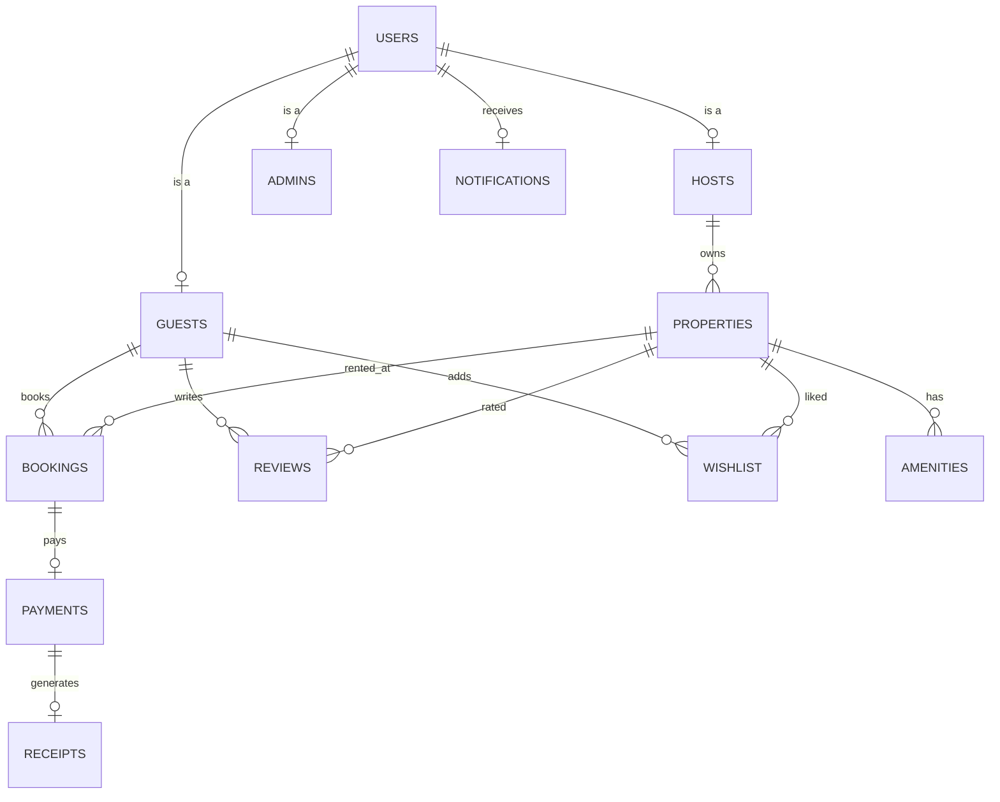

# StaySpace - Vacation Rental Booking Platform Implementation Plan

StaySpace is a full-stack vacation rental booking platform similar to Airbnb. It utilizes a multi-tiered architecture where all primary business logic and database queries are written in C++, bridged via Python Flask APIs, and displayed in a React + Vite + Tailwind CSS frontend.

---

## User Review Required

Please review the following core architecture decisions:
1. **C++/Python Bridge**: Python Flask executes the compiled C++ executable (`stayspace_core.exe`) via `subprocess` passes parameters as a JSON string, and receives JSON responses via stdout. This is highly reliable, robust on Windows, and isolates memory spaces.
2. **Database Connectivity**: The C++ core will connect to MySQL Server 8.0 dynamically loading `libmysql.dll` using Windows APIs (`LoadLibrary`/`GetProcAddress`). This bypasses compiler/linker compatibility issues between MSVC-compiled libs and MinGW GCC.
3. **Authentication**: Token-based authentication. The C++ module handles password hashing (using a robust hashing algorithm), session generation, and token validation, storing active sessions in the database.
4. **OOP Architecture**: 
   - A base `User` class with derived `GuestUser`, `HostUser`, and `AdminUser` classes showing **inheritance** and **polymorphism**.
   - Database operations wrapped in a database manager showing **encapsulation** and **abstraction**.
   - Reports and Receipts outputted using C++ **file handling** (`std::ofstream`).

---

## Proposed Changes

We will organize the code into the following directories:
- `Database/`: SQL scripts for database initialization.
- `CPP/`: Core C++ engine code including Makefile and all module sources.
- `Backend/`: Python Flask REST API server.
- `Frontend/`: React application using Vite, Tailwind CSS, and React Router.
- `Uploads/`: Storage for property images and user profile pictures.
- `Receipts/`: Text/PDF format transaction receipts generated by C++.

### Database Schema

We will initialize a MySQL database named `stayspace` with the following normalized tables:

- **`Users`**: Holds profile info, role, and encrypted password.
- **`Guests`**: Specific metadata for guests.
- **`Hosts`**: Host verification state and bios.
- **`Admins`**: Admin specific mappings.
- **`Properties`**: Vacation rental details (pricing, rules, locations).
- **`Amenities`**: Multi-valued characteristics of properties (Wifi, Pool, AC).
- **`Bookings`**: Check-in, check-out dates, status, and pricing.
- **`Payments`**: Payment simulation logs.
- **`Reviews`**: Ratings and comments.
- **`Wishlist`**: Guest-property bookmarks.
- **`Notifications`**: Real-time app notifications.
- **`Receipts`**: Path to receipt text files generated by C++.
- **`Reports`**: Metadata for admin/host reports.

---

### C++ Core Engine (`CPP/`)

The C++ Core Engine will compile into `stayspace_core.exe`. It uses a CLI structure:
`stayspace_core.exe <module> <action> <json_params>`

#### OOP Classes:
- **`DatabaseConnection`**: Single-instance DB manager dynamically linking to `libmysql.dll`.
- **`User` (Base Class)**: Virtual methods for profile views.
  - **`GuestUser` (Derived)**: Guest-specific booking details and wishlists.
  - **`HostUser` (Derived)**: Host-specific earnings and listing methods.
  - **`AdminUser` (Derived)**: Admin dashboard controls and reports.
- **`Property`**: Captures property records, search filters, and availability calendar logic.
- **`Booking`**: Holds booking validation logic (date overlaps, rates).
- **`Payment`**: Handles payment simulation, transaction logging, and receipt file writing.
- **`Review`**: Property rating aggregator and comment tracker.
- **`Notification`**: Inserts and reads notification messages.
- **`JsonParser`**: A custom C++ helper to tokenize and serialize simple JSON records without third-party dependencies.

---

### Python API Layer (`Backend/`)

Exposes a Flask server `app.py`. Responsible for:
- Exposing endpoints: `/api/auth/*`, `/api/properties/*`, `/api/bookings/*`, `/api/reviews/*`, `/api/admin/*`.
- Invoking `CPP/stayspace_core.exe` with structured CLI arguments.
- Handling file uploads (profile pics, property images) and storing them in `Uploads/`.
- Returning responses strictly in JSON.

---

### Frontend Layer (`Frontend/`)

A Vite React application using Tailwind CSS:
- **Pages**:
  - `LandingPage`: Gradient hero, search bar, featured properties.
  - `SearchPage`: Filter options (price, bedrooms, amenities) and properties listing.
  - `PropertyDetails`: Image carousel, host info, booking calendar, reviews, ratings.
  - `BookingPage`: Pricing summary and simulated checkout.
  - `Profile`: View/edit profile, upload picture, view booking history.
  - `Wishlist`: Saved properties.
  - `HostDashboard`: Stats, list properties, edit property, manage booking requests, earnings report.
  - `AdminDashboard`: Global stats, user lists, host approvals, system reports.

---

## Execution Phases

### Phase 1: Project Setup & Database
- Initialize folder structure: `CPP/`, `Backend/`, `Frontend/`, `Database/`, `Uploads/`, `Receipts/`.
- Write `Database/schema.sql` database scripts.
- Implement the `DatabaseConnection` class in C++ using dynamic loading of `libmysql.dll`.

### Phase 2: C++ CLI & Authentication Module
- Write C++ `JsonParser` utility.
- Implement `User` class hierarchy (Base `User`, `GuestUser`, `HostUser`, `AdminUser`).
- Create `Authentication` module in C++ (Register, Login, Password Hashing, Session Management).
- Create bridge script / test harness.

### Phase 3: Property Module (C++)
- Implement Property creation, update, deletion, search, filtering, and availability database queries.

### Phase 4: Booking Module (C++)
- Implement Booking verification (prevent double bookings on overlapping dates), creation, and cancellation.

### Phase 5: Payment Module & Receipt Generation (C++)
- Implement simulated payment gateway.
- Write receipt generator which writes clean text receipts under `Receipts/`.

### Phase 6: Review & Wishlist Modules (C++)
- Add/edit/delete reviews, aggregate average ratings.
- Manage guest wishlists.

### Phase 7: Notifications & Admin Modules (C++)
- Save notification items into database.
- Admin dashboards: statistics, approvals, block listing, report triggers.

### Phase 8: Python Backend Implementation
- Set up Flask routing structure in `Backend/`.
- Connect all API endpoints to call C++ core CLI binary.
- Add image upload logic.

### Phase 9: React Frontend Creation & Styling
- Bootstrap Vite React frontend.
- Set up Tailwind CSS styling config and custom color palette (`#FF385C`).
- Implement core layouts, landing page, and authentication forms.

### Phase 10: Frontend Pages & Dashboard UI
- Build Property details page, Booking forms, Wishlist, and Profile.
- Build detailed Host Dashboard and Admin Dashboard.

### Phase 11: Frontend-Backend Integration
- Connect React UI to Python APIs using Axios or fetch.
- Test end-to-end booking flow.

### Phase 12: Testing & Walkthrough
- Verify database state consistency.
- Demonstrate full UI walkthrough.

---

## Verification Plan

### Automated Verification
- C++ test executable that runs validation tests on all core modules (Db, Auth, Property, Bookings) without Python/Frontend.
- SQL validation queries checking key indices and constraints.

### Manual Verification
- Visual browser testing of the React frontend.
- API testing using postman/curl to verify Python-C++ communication.
